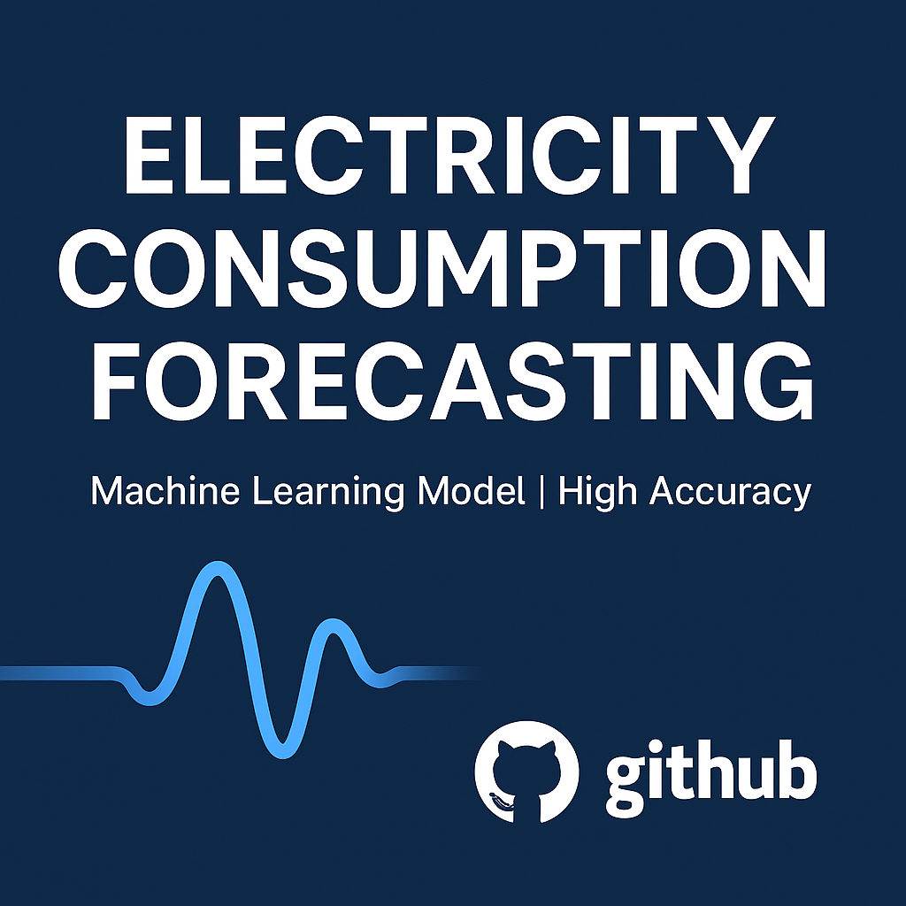

Electricity Consumption Forecasting

This project helps predict how much electricity will be used in the future. It uses machine learning algorith XGboost to make smart guesses about what might happen next.

What This Project Does:-

- Takes in electricity usage data
- Cleans and prepares the data
- Trains models (smart systems) to learn patterns
- Predicts future electricity usage
- Shows results in graphs and numbers

How to Use This Project:-

Step 1: Download the Project
Click the green "Code" button on GitHub and download the ZIP, or run this command if you're using Git:

git clone https://github.com/yourusername/electricity-consumption-forecasting.git

Step 2: Install Python Packages:-

Open your command line or terminal, go to the project folder, and run:
pip install -r requirements.txt
This installs all the tools the notebook needs.

Step 3: Open the Notebook:-

You can now open the Jupyter Notebook file located in the `notebook/` folder. 
Run the code step by step to see how the project works.

Files and Folders:-

- `notebook/` – Where the main notebook file is
- `data/` – You can put your dataset here
- `requirements.txt` – List of packages needed
- `README.md` – This file

Tools Used:-

- Python
- Pandas and NumPy for data
- Matplotlib and Seaborn for graphs
- Scikit-learn and XGBoost for machine learning
- Jupyter Notebook

What It Shows:-

The project tells you how well the model predicts electricity use. It shows results using numbers like:

- MAE (Mean Absolute Error) – smaller is better
- RMSE (Root Mean Square Error) – smaller is better
- R² (R-squared) – closer to 1 means better predictions

Things You Can Add Later:-

- A website (with Streamlit) to show predictions
- Better model tuning for more accuracy
- Add real-time data
- Upload online to share with others

License:-

You can use or change this project freely under the MIT License.

Thanks:-

Thanks to Python, open datasets, and all the great free tools that made this project possible.

